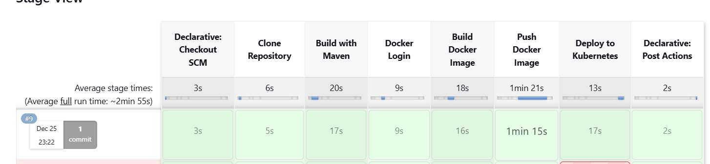

# robo-bob
<H2>Part 1</H2>
<H3>Assumptions</H3>

In the current scope add more questions
and answers. will be done by adding questions to the file

Flow of adding the questions to the external storage is not in he current scope

<H5>Development</H5>

 The application is developed as a Spring Boot application.

The code for RoboBob application
is under src/main/java
 

 Resource files are under src/main/resources

<H5>Testing</H5>

 Test files are under src/main/test

 Code coverage is done using jacoco. Files are under target\site\jacoco

<H5>Deployment</H5>

 Project is deployed as docker container being managed by kubernetes

Kubernetes files are under k8,DockerFile is created for building and pushing the image

<H5>CI/CD</H5>

 A Jenkins pipeline is used to automate the entire workflow

JenkinsFile is created for managing the pipeline

<H2>Part 2</H2>
<H3>Assumptions</H3>

The 100 qps are for reading the basic questions.The addition of questions is assumed to 100 new questions per day

A single record comprising of questions and answers would be around 200 KB

Questions are added by Admins users or users 
 with special privileges and no of such users are far less

The original condition of prompting the user to ask a different question in case of an 
  unknown question is still valid

The admin or privileged users determine which questions to add

F or same question multiple answer may exists

Cloud infrastructure is available through AWS.
