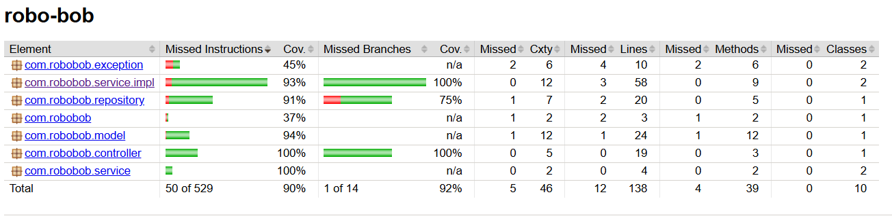
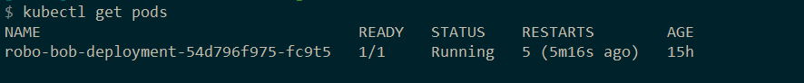

# robo-bob
<H2>Part 1</H2>
<H5>Development</H5>
  The application is developed as a Spring Boot application. 
 The code for RoboBob application
is under src/main/java  
  Resource files are under src/main/resources 
<H5>Testing</H5>
  Test files are under src/main/test 
  Code coverage is done using jacoco. Files are under target\site\jacoco 
  

<H5>Deployment</H5>
  Project is deployed as docker container being managed by kubernetes 
 Kubernetes files are under k8,DockerFile is created for building and pushing the image 
  

<H5>CICD</H5>
  A Jenkins pipeline is used to automate the entire workflow 
 JenkinsFile is created for managing the pipeline 
  
